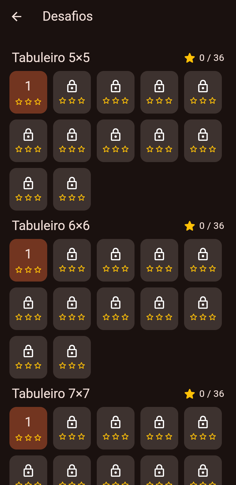
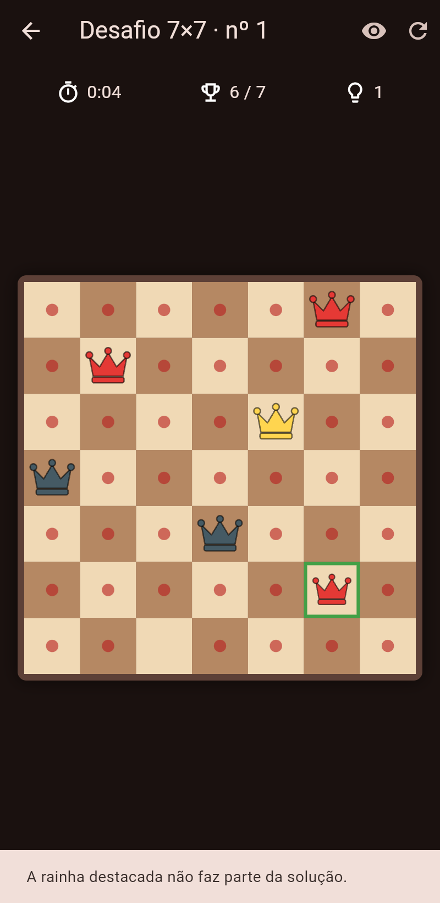

# Rainhas — o quebra-cabeça das N rainhas

Jogo para Android, feito em Flutter, baseado no clássico problema das oito
rainhas: colocar N rainhas num tabuleiro N×N sem que nenhuma ataque outra.

<p>
  
  
  
  
</p>

## O que o app tem

- **Modo Clássico** — tabuleiros de 4×4 a 12×12. O jogador tenta achar todas
  as soluções de cada tamanho (no 8×8 são 92) e bater o recorde de tempo.
- **Desafios** — 72 fases (tabuleiros de 5×5 a 10×10, 12 fases cada) com
  algumas rainhas fixas e **solução única**, estrelas por fase e liberação
  progressiva das fases.
- Dicas inteligentes (sugerem onde colocar ou qual rainha tirar), desfazer,
  cronômetro, destaque de conflitos e, opcionalmente, das casas atacadas.
- Progresso salvo no aparelho.
- **Anúncios AdMob**: banner no rodapé e anúncio de tela cheia a cada 3
  vitórias, com o formulário de consentimento do Google (LGPD/GDPR).

## Estrutura

```
lib/
  main.dart                  inicialização e tema
  game/solver.dart           solucionador (backtracking com máscara de bits)
  game/board.dart            regras, conflitos e dicas
  game/challenge.dart        gerador de desafios com solução única
  services/progress.dart     progresso salvo (shared_preferences)
  services/ads.dart          AdMob: IDs, consentimento, banner, tela cheia
  screens/                   telas (menu, seleção, jogo)
  widgets/board_view.dart    desenho do tabuleiro e da rainha
test/                        testes da lógica e da interface
docs/                        política de privacidade e textos da loja
```

## Rodando no seu computador

1. Instale o [Flutter](https://docs.flutter.dev/get-started/install) e o
   Android Studio (ele traz o Android SDK e o emulador).
2. Na pasta `rainhas`:
   ```
   flutter pub get
   flutter test          # roda os testes
   flutter run           # abre no emulador ou no celular conectado por USB
   ```

## Passo a passo para publicar na Google Play

### 1. Contas

- **Google Play Console**: https://play.google.com/console — taxa única de
  US$ 25. Contas pessoais novas precisam fazer um **teste fechado com pelo
  menos 12 testadores por 14 dias** antes de liberar a produção.
- **AdMob**: https://admob.google.com — vincule uma conta de pagamento
  (dados bancários e fiscais) para receber.

### 2. Trocar os IDs de anúncio de teste pelos seus

No AdMob, crie o app (Android) e dois blocos de anúncio: um **Banner** e um
**Intersticial**. Depois troque:

| Onde | O quê |
|------|-------|
| `android/app/src/main/AndroidManifest.xml` | `APPLICATION_ID` (formato `ca-app-pub-XXXX~YYYY`) |
| `lib/services/ads.dart` → `AdIds.banner` | ID do bloco Banner (`ca-app-pub-XXXX/ZZZZ`) |
| `lib/services/ads.dart` → `AdIds.interstitial` | ID do bloco Intersticial |

> Enquanto estiver testando no seu celular, use os IDs de teste ou cadastre
> o aparelho como dispositivo de teste no AdMob. **Clicar nos próprios
> anúncios reais pode bloquear a conta.**

No AdMob, em *Privacidade e mensagens*, crie a mensagem de consentimento
GDPR — o app já mostra o formulário automaticamente quando necessário.

### 3. Conferir o Application ID

O ID atual é `br.nilton.rainhas` (em `android/app/build.gradle.kts`).
Ele identifica o app na loja para sempre; se quiser outro, troque **antes**
da primeira publicação.

### 4. Criar a chave de assinatura (uma única vez)

```
keytool -genkey -v -keystore ~/rainhas-upload.jks -keyalg RSA -keysize 2048 -validity 10000 -alias upload
```

Crie o arquivo `android/key.properties` (ele está no `.gitignore` e
**não deve** ir para o GitHub):

```
storePassword=SUA_SENHA
keyPassword=SUA_SENHA
keyAlias=upload
storeFile=/caminho/para/rainhas-upload.jks
```

Guarde o `.jks` e as senhas num lugar seguro (backup!). Com o *Play App
Signing* (padrão), o Google guarda a chave final e esta é só a de envio.

### 5. Gerar o pacote

A cada nova versão, aumente o número em `pubspec.yaml`
(`version: 1.0.0+1` → `1.0.1+2`; o número depois do `+` sempre sobe) e rode:

```
flutter build appbundle --release
```

O arquivo sai em `build/app/outputs/bundle/release/app-release.aab`.

### 6. Preencher a Play Console

- Crie o app, envie o `.aab` na trilha de **teste fechado** (depois produção).
- **Página da loja**: textos prontos em `docs/loja.md`. Você também vai
  precisar de ícone 512×512, imagem de destaque 1024×500 e 2 a 8 capturas
  de tela do celular.
- **Política de privacidade**: publique o `docs/politica-de-privacidade.md`
  numa URL pública (ex.: GitHub Pages ou Google Sites) e informe o link.
- **Conteúdo do app**: marque que **contém anúncios**; público-alvo 13+
  (evita as regras mais rígidas de apps para crianças); classificação
  indicativa (questionário IARC); *Segurança dos dados*: o SDK do AdMob
  coleta ID de publicidade, dados de diagnóstico e localização aproximada
  (IP) para anúncios — declare conforme a
  [orientação do Google](https://developers.google.com/admob/android/privacy/play-data-disclosure).

## Ideias para próximas versões

- Compra "Remover anúncios" (Google Play Billing).
- Ícone próprio e tela de abertura (hoje usa o ícone padrão do Flutter).
- Tradução para inglês e espanhol, para vender no mundo todo.
- Desafio diário e placar online (Google Play Games).
