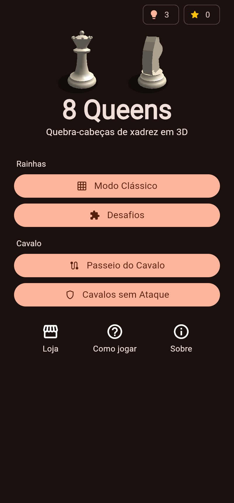
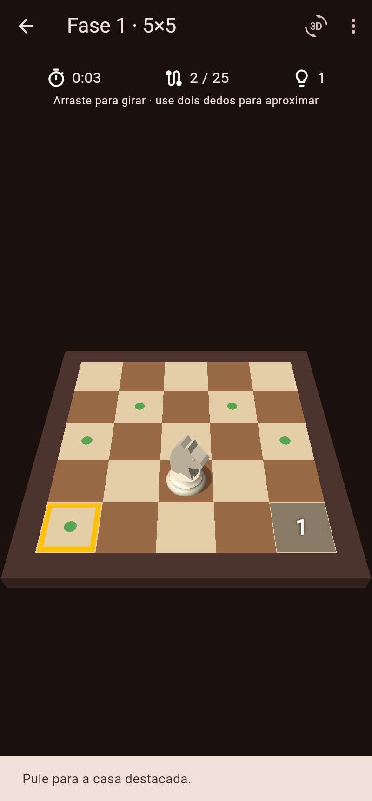
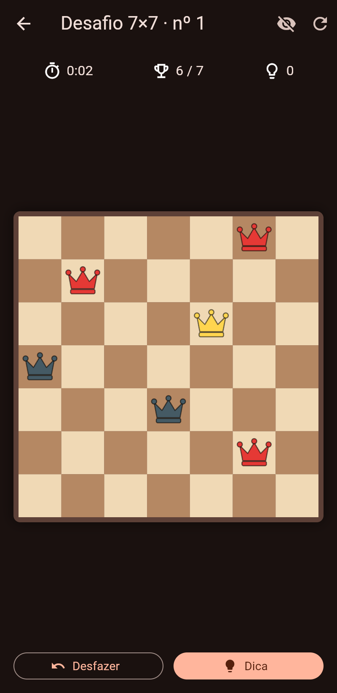
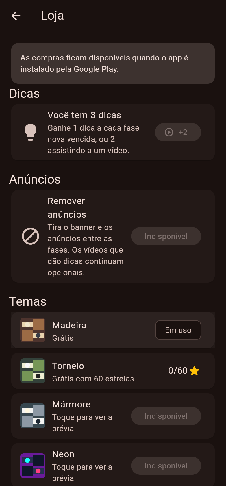

# 8 Queens — quebra-cabeças de xadrez em 3D

Jogo para Android, feito em Flutter, com quebra-cabeças clássicos do xadrez:
o problema das oito rainhas e desafios com o cavalo. Tabuleiro e peças em
**3D**, com luz, sombras e câmera livre.

<p>
  
  
  
  
</p>

## O que o app tem

- **Rainhas — Modo Clássico**: tabuleiros de 4×4 a 12×12, sem fases. O
  jogador tenta achar todas as soluções de cada tamanho (no 8×8 são 92).
- **Rainhas — Desafios**: 72 fases com algumas rainhas fixas e solução única.
- **Passeio do Cavalo**: 32 fases (5×5 a 8×8). O cavalo precisa passar por
  todas as casas livres uma única vez; nas fases mais adiantadas há casas
  bloqueadas. Toda fase tem solução garantida.
- **Cavalos sem Ataque**: 32 fases com casas bloqueadas; colocar o máximo de
  cavalos sem que se ataquem (o máximo é calculado por emparelhamento em
  grafo bipartido, e as fases são escolhidas para que o truque de "usar só
  uma cor" não funcione).
- **Trilha única de fases**: cada fase libera a próxima, e o tabuleiro
  seguinte só abre depois de vencer todas as fases do anterior.
- **Dicas como recurso**: começa com 3; cada fase nova vencida dá +1; sem
  saldo, o jogador pode assistir a um vídeo para ganhar +2.
- **Tabuleiro 3D**: rainha e cavalo modelados em 3D, câmera que gira com o
  dedo, zoom com dois dedos, peças que caem e pulam, comemoração na vitória.
- **Monetização**: banner, anúncio de tela cheia a cada 3 vitórias, vídeo
  com recompensa (dicas), compra "Remover anúncios" e temas pagos (Mármore e
  Neon). O tema Torneio é liberado de graça com 60 estrelas.
- Tela **Sobre** com as informações do desenvolvedor.

## Estrutura

```
lib/
  main.dart                   inicialização e tema
  config/app_info.dart        nome do app e dados do desenvolvedor
  game/solver.dart            solucionador das rainhas (máscara de bits)
  game/board.dart             regras das rainhas, conflitos e dicas
  game/challenge.dart         desafios das rainhas com solução única
  game/knights.dart           passeio do cavalo e cavalos sem ataque
  game/levels.dart            modos, fases e trilha
  services/progress.dart      progresso, dicas, temas e compras (no aparelho)
  services/ads.dart           AdMob: banner, tela cheia e vídeo com recompensa
  services/store.dart         compras pela Google Play
  render3d/                   motor 3D próprio (câmera, malhas, luz, temas)
  widgets/board_3d.dart       tabuleiro 3D interativo
  widgets/game_ui.dart        partes comuns das telas de jogo
  screens/                    telas
test/                         testes da lógica e da interface
docs/                         política de privacidade e textos da loja
```

## Rodando no seu computador

1. Instale o [Flutter](https://docs.flutter.dev/get-started/install) e o
   Android Studio (ele traz o Android SDK e o emulador).
2. Na pasta `rainhas`:
   ```
   flutter pub get
   flutter test          # roda os testes
   flutter run           # abre no emulador ou no celular conectado por USB
   ```

## Passo a passo para publicar na Google Play

### 1. Contas

- **Google Play Console**: https://play.google.com/console — taxa única de
  US$ 25. Contas pessoais novas precisam fazer um **teste fechado com pelo
  menos 12 testadores por 14 dias** antes de liberar a produção.
- **AdMob**: https://admob.google.com — vincule uma conta de pagamento
  (dados bancários e fiscais) para receber.

### 2. Trocar os IDs de anúncio de teste pelos seus

No AdMob, crie o app (Android) e três blocos de anúncio: **Banner**,
**Intersticial** e **Premiado** (vídeo com recompensa). Depois troque:

| Onde | O quê |
|------|-------|
| `android/app/src/main/AndroidManifest.xml` | `APPLICATION_ID` (formato `ca-app-pub-XXXX~YYYY`) |
| `lib/services/ads.dart` → `AdIds.banner` | ID do bloco Banner (`ca-app-pub-XXXX/ZZZZ`) |
| `lib/services/ads.dart` → `AdIds.interstitial` | ID do bloco Intersticial |
| `lib/services/ads.dart` → `AdIds.rewarded` | ID do bloco Premiado |

> Enquanto estiver testando no seu celular, use os IDs de teste ou cadastre
> o aparelho como dispositivo de teste no AdMob. **Clicar nos próprios
> anúncios reais pode bloquear a conta.**

No AdMob, em *Privacidade e mensagens*, crie a mensagem de consentimento
GDPR — o app já mostra o formulário automaticamente quando necessário.

### 3. Produtos da loja (compras no app)

Na Play Console, em **Monetizar › Produtos › Produtos no app**, crie estes
produtos (IDs exatamente iguais; todos são compras únicas):

| ID do produto | O que libera | Preço sugerido |
|---------------|--------------|----------------|
| `remover_anuncios` | tira banner e anúncios entre fases | R$ 9,90 |
| `tema_marmore` | tema Mármore | R$ 4,90 |
| `tema_neon` | tema Neon | R$ 4,90 |

As compras só funcionam com o app instalado pela Play Store (use a trilha de
**teste interno** e adicione seu e-mail como testador de licença em
*Configurações › Teste de licença* para comprar sem ser cobrado). Num APK
instalado à mão, a loja aparece como indisponível.

### 4. Dados do desenvolvedor

Edite `lib/config/app_info.dart`: e-mail de contato e o endereço da política
de privacidade (os dois aparecem na tela **Sobre**; vazios, ficam ocultos).

### 5. Conferir o Application ID

O ID atual é `br.nilton.rainhas` (em `android/app/build.gradle.kts`).
Ele identifica o app na loja para sempre; se quiser outro, troque **antes**
da primeira publicação.

### 6. Criar a chave de assinatura (uma única vez)

```
keytool -genkey -v -keystore ~/rainhas-upload.jks -keyalg RSA -keysize 2048 -validity 10000 -alias upload
```

Crie o arquivo `android/key.properties` (ele está no `.gitignore` e
**não deve** ir para o GitHub):

```
storePassword=SUA_SENHA
keyPassword=SUA_SENHA
keyAlias=upload
storeFile=/caminho/para/rainhas-upload.jks
```

Guarde o `.jks` e as senhas num lugar seguro (backup!). Com o *Play App
Signing* (padrão), o Google guarda a chave final e esta é só a de envio.

### 7. Gerar o pacote

A cada nova versão, aumente o número em `pubspec.yaml`
(`version: 1.0.0+1` → `1.0.1+2`; o número depois do `+` sempre sobe) e rode:

```
flutter build appbundle --release
```

O arquivo sai em `build/app/outputs/bundle/release/app-release.aab`.

### 8. Preencher a Play Console

- Crie o app, envie o `.aab` na trilha de **teste fechado** (depois produção).
- **Página da loja**: textos prontos em `docs/loja.md`. Você também vai
  precisar de ícone 512×512, imagem de destaque 1024×500 e 2 a 8 capturas
  de tela do celular.
- **Política de privacidade**: já publicada pelo GitHub Pages em
  https://niltonbrustolin.github.io/exemplos-delphi/8queens/politica-de-privacidade.html
  (o arquivo fica em `docs/8queens/` na raiz do repositório). Informe esse
  link na Play Console.
- **Conteúdo do app**: marque que **contém anúncios**; público-alvo 13+
  (evita as regras mais rígidas de apps para crianças); classificação
  indicativa (questionário IARC); *Segurança dos dados*: o SDK do AdMob
  coleta ID de publicidade, dados de diagnóstico e localização aproximada
  (IP) para anúncios — declare conforme a
  [orientação do Google](https://developers.google.com/admob/android/privacy/play-data-disclosure).

## Ideias para próximas versões

- Ícone próprio e tela de abertura (hoje usa o ícone padrão do Flutter).
- Tradução para inglês e espanhol, para vender no mundo todo.
- Desafio diário e placar online (Google Play Games).
- Validação das compras num servidor (hoje a compra é registrada só no
  aparelho).
